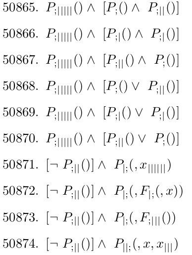
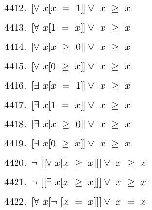
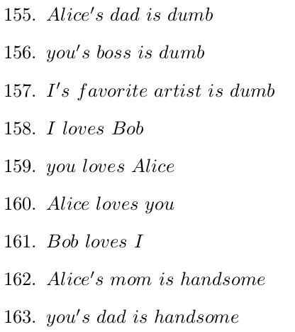

Generator of logical expressions with the ability to translate them to a given *language*. 
This algorithm can be used to **generate methematical expressions**.\
*Pretty cool, right?*

1st place at **HSE CS project contest** among HSE lyceum students.

### Examples

All the output is translated to LaTeX:

|     |     |     |
|:---:|:---:|:---:|
|*Basic*|*Mathematical*|*English*|
||||
 
Adjacent expressions are similar because the algorithm outputs the lines in lexigraphic order

Here are actually interesting generated "statements" (not all of them are true)

**1.** 2 is a prime number\
**2.** <del>Every number is prime</del>\
**3.** A prime number exists **!**\
**5.** Every number is equal to itself\
**6.** There exists a number that is equal to itself\
**7.** Not all numbers are prime\
**8.** <del>Prime numbers don't exist</del>
